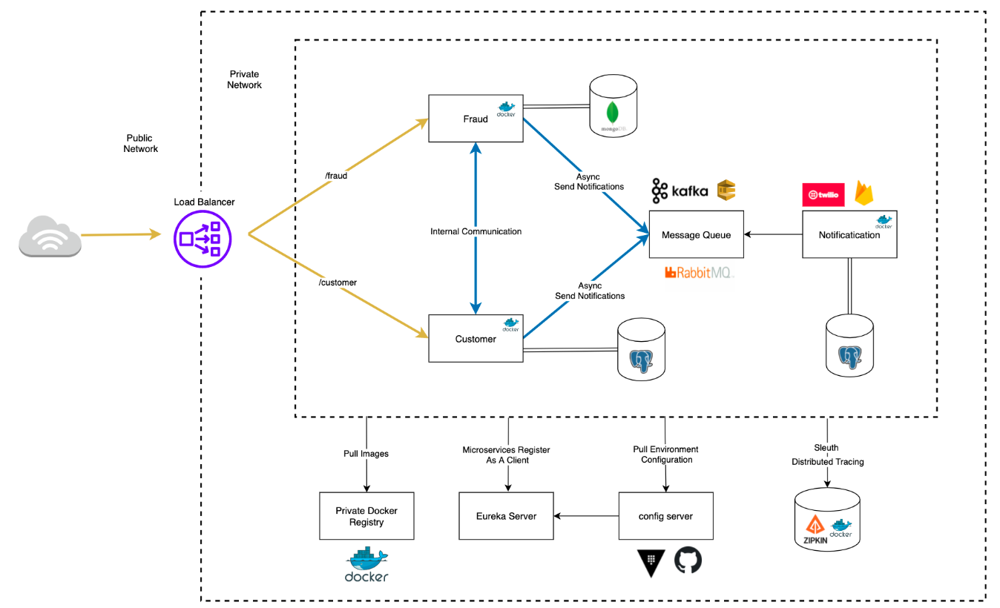
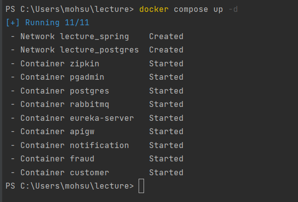
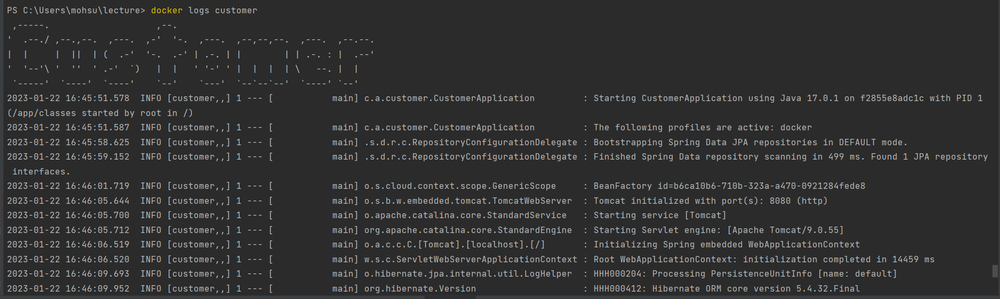
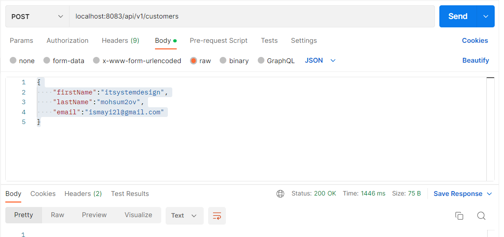
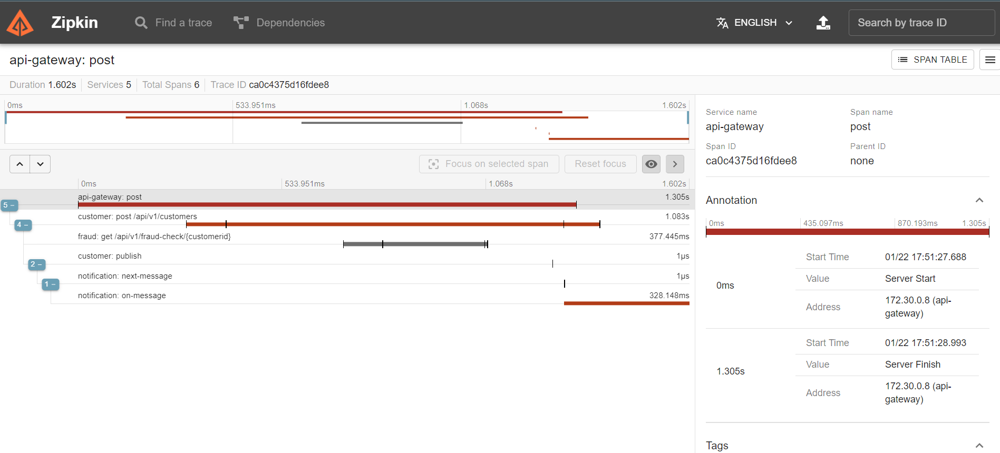
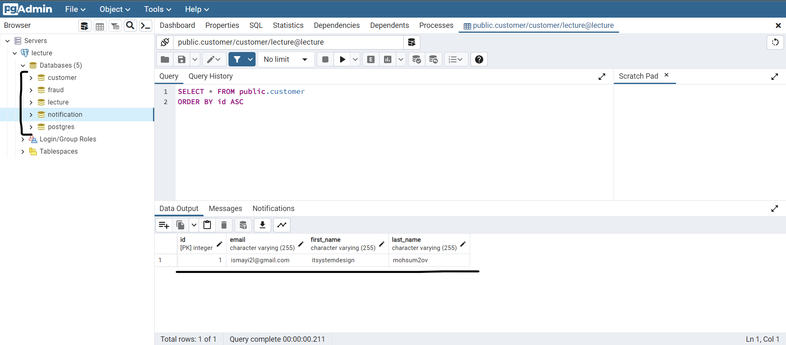

# IT Sytem design 

User Management System with Microservices architecure the project contains 7 (seven) microservices and each of them serves for different purposes. I will describe all of them seperately within details.


## Tech Stack

**Java Spring,** **Maven,** **Zipkin,** **Postgres,** **Docker,** 
**RabbitMQ**


## Run Locally

Clone the project

```bash
  git clone https://link-to-project
```

Go to the project directory

```bash
  cd my-project
```

Run images

```bash
  docker compose up -d
```

Start the server

```bash
  Send POST request to: 
  
  localhost:8083/api/v1/customers
  
  with body:

  {
    "firstName":"itsystemdesign",
    "lastName":"lecture",
    "email":"aeh@vizja.pl"
}
```

## Architecture



## Project in action

1. Run images

```bash
  docker compose up -d
```


2. Check logs for **customer**

```bash
  docker logs customer
```


3. Send request using postman

#### Get all items

```http
  POST /api/v1/customers
  
  {
    "firstName":"itsystemdesign",
    "lastName":"mohsum2ov",
    "email":"ismayi2l@gmail.com"
}
```

| Parameter | Type   | Description        |
|:----------|:-------|:-------------------|
| `raw`     | `JSON` | **Required**. Body |



4. Check logs using **zipkin**

#### Open browser and search for http://localhost:9411/zipkin/




5. Check database

#### Open browser and search for http://localhost:5050/browser/

